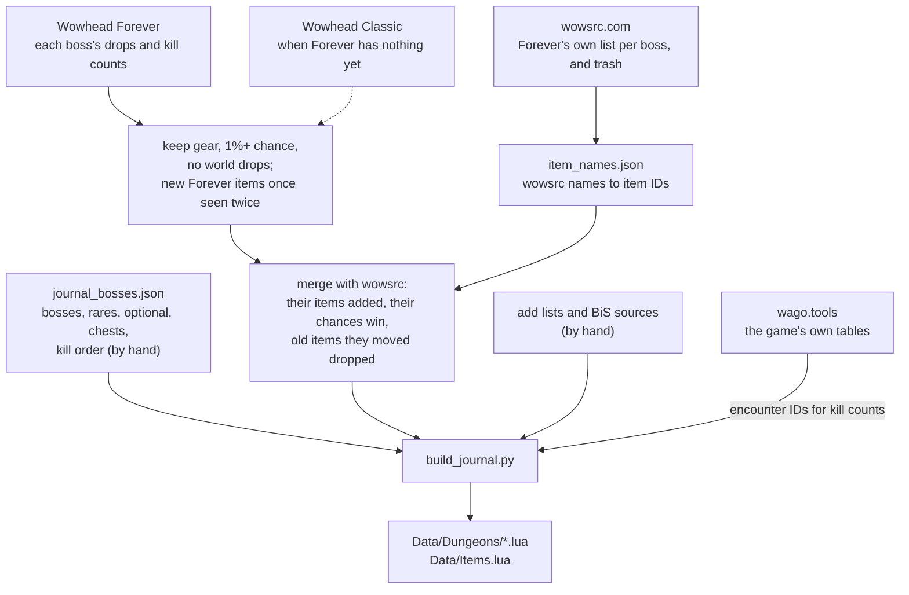

# Dungeon Journal

Every dungeon's bosses in kill order (rares, optional bosses and loot chests too, and a Trash
card), what each drops and how often, your BiS marked, your quests there, and a tip from
Naowh for each boss. Each classic dungeon has a map: the game's own art with every boss where
it stands, in a window of its own or filling the world map inside the dungeon. Its Reputation tab has each faction's
rewards by standing, with their prices; its PvP tab your rank this season, what each rank
gives, and the battleground factions. Off by default: players turn it on in the Dungeon
Journal settings page.

This module is the addon's reference for how a module is laid out and written. Its folder
holds everything that is only its own, and it loads through its own `DungeonJournal.xml`.
What any module can use (the house style, components, windows, the row engine) is in
[`Shared/`](../Shared/README.md); the BiS List is built the same way.

## Layout

```
DungeonJournal/
  DungeonJournal.xml   what loads, in order (the TOC includes only this file)
  Journal.lua          settings, the dungeon and faction registry and the public API (ns.Journal)
  Loot.lua             the loot rules: what is listed, BiS ranks, upgrades, looks (J.Loot)
  Quests.lua           the quest rules: where each quest stands, its chain, waypoints (J.Quests)
  Reputation.lua       your standing, rewards reached, prices, your PvP rank (J.Reputation)
  Team.lua             who was in your group, kept with a kill or an item (J.Team)
  Kills.lua            this character's kills of each boss: when, and who was with it, and
                       which were this run (J.Kills)
  Looted.lua           what this character has looted in the Journal's dungeons: where, who was
                       with it, and the rolls (J.Looted)
  Sharing.lua          asking a group member with Naowh Forever to share a quest (J.Sharing)
  Quartermasters.lua   where each faction's quartermaster stands, learned at the vendor
  Data/                data, no logic
    Dungeons/*.lua     one per dungeon, generated
    Factions/*.lua     one per faction with rewards, generated
    Items.lua          item facts for before the client has loaded an item, generated
    FactionItems.lua   the same for the factions' rewards, generated
    Build.lua          the game build the data is read from and its date, generated
    Quests.lua         every dungeon quest, from Wowhead's Forever guide, with hand additions
    QuestChains.lua    each quest's chain, prerequisites and required level, generated
    BiSQuests.lua      the quests that reward a BiS, for the BiS List's Quests page, generated
    Tips.lua           Naowh's tips, by hand
    Maps.lua           each dungeon's map art and where its bosses stand, by hand
  View/                draws one page (a dungeon, a faction, the PvP rank); used by the window,
                       the map panel and the popup
    Style.lua          what only the Journal draws (the house look is Shared/Style.lua)
    View.lua           a dungeon, a faction, the rank and search, on the shared engine
    Parts.lua          a fight's length, and its side panels at the Journal's opacity
    Header.lua         the dungeon's name, entrance pin, zone and stats
    QuestRows.lua      your quests: marks, hover card, right-click menu
    BossCards.lua      boss cards, tips and sharing them, the folded-boss chips
    ItemRows.lua       one item of a boss's loot, or of a faction's rewards with its price
    FactionRows.lua    a faction's or the rank's header, standing bar, card headers and links
    ItemMenu.lua       an item's right-click menu (the BiS list)
    QuestPanel.lua     a quest in your log, in the side panel
    BossPanel.lua      a boss's history: each kill, who was with you, what you looted and the rolls
  UI/                  where it shows
    DungeonList.lua    the window's list of dungeons, grouped by your level
    FactionList.lua    the window's list on the Reputation and PvP tabs
    Recent.lua         Recent on the window's title bar: this character's latest kills and loot
    Window.lua         the Journal's window (/nfjournal, /nfdj, its own key binding) and its tabs
    MapPanel.lua       beside the world map, inside a dungeon: puts the window away while the
                       map is open, folds the game's quest log, says when the dungeon's map
                       shows on the world map
    Popup.lua          Boss Loot at Cursor (a key binding)
    QuestTracker.lua   a dungeon's quests in a small window, one line each
    DungeonMap.lua     a dungeon's map: in its own window (with the bosses in kill order, this
                       run's progress and the picked boss's loot under it), and on the world
                       map; /nf mappins to place pins, /nf mapcheck for the client's map art
    SettingsPage.lua   its settings page (Dungeon Journal/Settings), declared as cards
```

Each layer only uses the ones above it: `Data` fills `Journal`, `Loot` and `Quests` read
both, `View` draws what they decide, and `UI` places a view on screen. Everything the
module shares hangs off `ns.Journal` (`J`); only the entry points the rest of the addon
calls are on `ns`.

## I want to change...

| What | Where |
| --- | --- |
| A colour, a size, spacing, an icon | `View/Style.lua`; the house look every module shares (borders, BiS stars, cards, item rows, windows) is `Shared/Style.lua`. The dungeon map's own sizes are at the top of `UI/DungeonMap.lua` |
| A boss tip | `Data/Tips.lua`, keyed by the boss's NPC ID, one short sentence |
| A dungeon's bosses, wings, kill order, entrance or zone | `Tools/journal_bosses.json`, then `python Tools/build_journal.py` |
| A rare, an optional boss or a loot chest | `"rare"`, `"optional"` or `"chests": { "Name": objectID }` on its wing in `Tools/journal_bosses.json` |
| An item a boss drops that no source has placed yet | `"add": { "Boss Name": [itemID] }` on the dungeon (`"Trash"` for its trash) |
| A boss wowsrc names differently | `"wowsrcNames": { "Their Name": "Our Name" }` on the dungeon |
| A boss's NPC ID the build cannot find | `"npcs": { "Name": ID }` on the dungeon in `Tools/journal_bosses.json` |
| Where a boss stands on its dungeon's map | `/nf mappins` in game, drag the pins, Copy, and paste the line into `Data/Maps.lua`. `/nf mapcheck` says which map art and floors the client has |
| A dungeon's map | `Data/Maps.lua`: its art folder (`Interface\WorldMap\<art>`) and floor count, as `/nf mapcheck` finds them; with none, Map says "Coming soon" |
| A key binding | `Bindings.xml` and its `BINDING_NAME_...` line (Open Dungeon Journal is in `UI/Window.lua`, Boss Loot at Cursor in `UI/Popup.lua`) |
| An icon's drawing | its function in `Tools/make_media.py`, then run it (writes `Media/*.tga`) |
| What counts as usable, BiS, an upgrade, a new look | `Loot.lua` |
| A quest's state, the list's order, where its waypoint goes | `Quests.lua` |
| A dungeon quest | `Data/Quests.lua`, then `python Tools/build_quest_chains.py` for its chain |
| A faction, its zone or the dungeons it is earned in | `Tools/journal_factions.json`, then `python Tools/build_factions.py` |
| What a standing means, prices in short, the PvP rank | `Reputation.lua` |
| The game build the faction data is read from | `BUILD` in `Tools/wago.py`; the daily build watcher (`.github/workflows/daily-watch.yml`) opens a pull request when a newer one is out (or, where the organization does not let workflows open one, an issue with a one-click link to it). Items a new build lacks because wago.tools has not recorded its hotfixes yet are carried over from the build before (`CARRY_FROM`), and the pull request lists them |
| A setting or its default | `Journal.lua` (`UI.ModuleSettings("journal", ...)`) and its card in `UI/SettingsPage.lua` |

`Data/Dungeons/*.lua`, `Data/Factions/*.lua`, `Data/Items.lua`, `Data/FactionItems.lua`, `Data/Build.lua` and
`Data/QuestChains.lua` and `Data/BiSQuests.lua` are generated: change their source and rebuild rather than editing
them, or the next build undoes the edit.

The style rules (named values, 1px black edges, the accent, lining icons up with the
Naowh font) are the addon's, in `.github/CONTRIBUTING.md` under Style.

## Where the loot comes from

Nothing in the game client says who drops what (loot lives on the server), so the boss loot
is put together offline by `Tools/build_journal.py` and shipped as data. No source is right
on its own, so the build stacks them:



The rules, in plain words:

- **Wowhead** gives the drops and how often. It counts Classic Era's kills and Forever's
  together, so a new Forever item looks rarer than it is: it's kept once it has dropped
  twice, and shows no chance. A boss that's new in Forever has only Forever's kills, so its
  chances are real. Under 10 kills, no chance is shown.
- **wowsrc.com** lists what each boss drops in Forever (they gave us permission to use
  their site). It wins where it disagrees: its items go in, its chance is used, and an old
  item it lists somewhere else is taken off the boss. It's also where each Trash card comes
  from. Its pages have no item IDs, so `Tools/wowsrc.py` maps names to IDs once and keeps
  them in `Tools/item_names.json`.
- **By hand** (`"add"`): items two other sources agree on that neither Wowhead nor wowsrc
  places yet.
- A boss nobody has loot for yet says so on its card. Keys, quest items and recipes are left
  out: the Journal lists gear.

To refresh it all: `python Tools/wowsrc.py` (new pages), `python Tools/wowsrc.py --resolve`
(new names), then `python Tools/build_journal.py`. Read what the build prints at the end:
bosses it found no loot for, wowsrc bosses we don't list, names it couldn't map.

The daily CI does the same when wowsrc's pages change (`.github/workflows/daily-watch.yml`,
its `loot` job), with `--offline`: Wowhead is never asked there, a new item's facts come from
the game's own tables, and what they can't settle is listed in the pull request it opens.

## Adding things

- **A dungeon:** add it to `Tools/journal_bosses.json`, rebuild, and add the line the build
  prints to `DungeonJournal.xml`.
- **A faction:** add it to `Tools/journal_factions.json` (its ID and tab), run
  `python Tools/build_factions.py`, and add the line it prints to `DungeonJournal.xml`. Its
  rewards, their standings and prices come from the game's own item tables, through
  wago.tools (`Tools/wago.py`, whose `BUILD` is the game build they are read from). Its
  `zone`, any zones in its `"alsoIn"` list and its `battleground` become the game's map and
  instance IDs, from the game's map tables: there, the world map shows its page beside it
  (Factions Beside the Map). A zone name the tables do not know stops the build.
- **A faction reward the game's tables do not have yet** (announced, on the test realm):
  add it to the faction's `"add"` list in `Tools/journal_factions.json`, then run
  `python Tools/build_factions.py`. Standing by name, price in coins, both as the game
  writes them; `price` and `note` can be left out:

  ```json
  "add": [
      { "item": 272063, "standing": "Honored", "price": "9g 1s 14c", "note": "on the PTR" }
  ],
  "remove": [ 4996 ]
  ```

  `"remove"` drops a reward the tables have wrong. Once the game's tables list an added item
  as the faction's reward, theirs win and the build (and the build watcher's pull request)
  says its line can go.
- **A faction's repeatable hand-in:** the game's tables have no quest rewards (the server
  sends them), so these are kept by hand in the faction's `"turnins"` list in
  `Tools/journal_factions.json`, from the quest's page on Wowhead Forever: its name, its IDs
  (one per side), the reputation one hand-in gives and the items it takes. Then run
  `python Tools/build_factions.py`; an item the game's tables do not know stops it, as a typo.
  The faction's page lists them under Quests, with how many your bags hold:

  ```json
  "turnins": [
      { "name": "Minion's Scourgestones", "quests": [5402, 5408, 5510], "rep": 25, "takes": [[12840, 20]] }
  ]
  ```
- **A row kind:** a file in `View/` that fills `J.View.Kinds.<name>` with `New(view)`
  (makes the frame once) and `Set(row, ...)` (fills it and returns its height). List it in
  `DungeonJournal.xml` after `View/View.lua`, and draw it with `view:Add("<name>", ...)`.
  A kind every module could use goes in `Shared/Kinds.lua` instead.
- **A file:** list it in `DungeonJournal.xml`, never in the TOC.

## Checking

- `luacheck .` from the repo root.
- `lua Tools/regression/test-dungeon-journal.lua` from the repo root: loads every file
  `DungeonJournal.xml` lists, in order, against stubs, and checks the data, the loot and
  reputation rules, what counting costs, the window's tabs, and that nothing is made or
  hooked while it is off.
  It also times what runs often (a page's BiS count, the list's repaint, the map and its
  legend drawn) and fails if one goes over its budget or makes garbage.
- `lua Tools/regression/test-journal-quests.lua`: the quest rules and the quest data.
- `python -m unittest discover -s Tools/tests`: the builders' rules (what a boss keeps, the
  wowsrc merge, the daily checks).
- In game: `/reload` after changing a file. If a new file or texture does not show up,
  restart the game.
