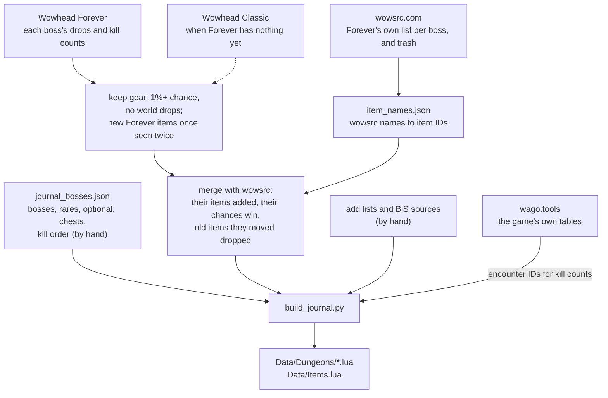

# Dungeon Journal

Every dungeon's bosses in kill order (rares, optional bosses and loot chests too, and a Trash
card), what each drops and how often, your BiS marked, your quests there, and a tip from
Naowh for each boss. Each classic dungeon has a map: the game's own art with every boss where
it stands, in a window of its own or filling the world map inside the dungeon. Its Reputation
tab has each faction's rewards by standing, with their prices; its PvP tab your rank this
season, what each rank gives, and the battleground factions. Off by default: players turn it
on in the Dungeon Journal settings page. It works without the BiS List: your BiS is marked only
while that is on, and the Journal offers to turn it on where it would show.

This module is the addon's reference for how a module is laid out and written (see
[`.github/STYLE.md`](../.github/STYLE.md)). Its folder holds everything that is only its own,
and it loads through its own `DungeonJournal.xml`. What any module can use (the house style,
components, windows, the row engine) is in [`Shared/`](../Shared/README.md); the BiS List is
built the same way.

## Layout

```
NaowhForever_DungeonJournal/
  NaowhForever_DungeonJournal.toc   its metadata, and one file line: DungeonJournal.xml
  DungeonJournal.xml   every file, in load order
  DungeonJournal.lua   settings (switch defaults from ns.FEATURES.journal), the dungeon and faction registry, the public API (ns.Journal, J)
  Constants.lua        the numbers several files share: a quest record's fields, the map art's size and path (J.C)
  Loot.lua             the loot rules: what is listed, BiS ranks, upgrades, looks (J.Loot)
  Quests.lua           the quest rules: where each quest stands, its chain, its waypoint (J.Quests)
  Reputation.lua       your standing, rewards reached, prices, your PvP rank (J.Reputation)
  Team.lua             who was in your group and how they rolled, as short lines of text (J.Team)
  Kills.lua            this character's kills of each boss: when, how long, with whom, this run (J.Kills)
  Looted.lua           what this character has looted in the Journal's dungeons, with whom, the rolls (J.Looted)
  Sharing.lua          asking a group member with Naowh Forever to share a quest, and answering (J.Sharing)
  ShareQuests.lua      Share All: a dungeon's quests in your log shared with your group, one at a time
  AcceptShared.lua     Accept Shared Dungeon Quests
  Quartermasters.lua   where each faction's quartermaster and your rank vendor stand, learned at the vendor
  ItemProbe.lua        /nf itemprobe: asks the server for every item listed, for Tools/items_in_game.py
  Data/                data, no logic
    Build.lua          the game build the data is read from and its date, generated
    Items.lua          the loot not in Forever yet, generated (the rest is Shared's ItemFacts)
    Quests.lua         every dungeon quest, from Wowhead's Forever guide, with hand additions
    QuestChains.lua    each quest's chain, prerequisites and required level, generated
    BiSQuests.lua      the quests that reward a BiS, for the BiS List's Quests page, generated
    Dungeons/*.lua     one per dungeon, generated
    Maps.lua           each dungeon's map art and where its bosses stand, by hand
    Factions/*.lua     one per faction with rewards, generated
    Tips.lua           Naowh's tips, by hand
    Abilities.lua      each boss's abilities as spell IDs, generated
    BossInfo.lua       each boss's level, kind and title, generated
    BossQuests.lua     the dungeon quests that need each boss, generated
  View/                drawing a page on the shared row engine; used by the window, the map panel and the popups
    Style.lua          what only the Journal draws: colors, icons, sizes (J.Style, over Shared/Style.lua)
    View.lua           the view: per-draw answers, its events and redraws (J.View)
    Parts.lua          a fight's length, a row's band to its card's edges, side panels at the Journal's opacity
    DungeonPage.lua    a dungeon's page: header, quests, each wing's boss cards, trash, the folded bosses
    BossPage.lua       a boss's own page: stacked (Boss Loot at Cursor) or compact (the dungeon map)
    FactionPage.lua    a faction's page and the PvP rank's
    SearchPage.lua     a search over every boss, item and faction reward
    DungeonHeader.lua  the dungeon's name, entrance pin, zone and stats
    QuestRows.lua      your quests: marks, hover card, right-click menu
    BossTips.lua       Naowh's tips: tooltip lines, sharing one in chat, the tip row
    KillCount.lua      the skull and a boss's kill count, its tooltip and the history it opens
    BossCards.lua      a boss card's header
    BossChips.lua      the bosses with nothing for you, as chips
    ItemRows.lua       one item of a boss's loot, or a faction's reward with its price
    BossHeader.lua     a boss page's top: name, kill count, level and kind
    BossQuestRows.lua  the quests that need a boss, as rows or chips
    AbilityRows.lua    one of a boss's abilities
    FactionHeader.lua  a faction's or the rank's header: where, quartermaster pin, stats
    StandingTrack.lua  your standing as a track, a segment per standing
    RankTrack.lua      your PvP rank as a track, a segment per rank
    TierHeader.lua     a card's header for one standing's or rank's rewards
    RewardGroup.lua    a kind of reward in a standing's card (gear, recipes, the rest)
    FactionLinks.lua   links between a faction and its dungeons
    IconLine.lua       a line under a faction's standing (what unlocked rewards would cost)
    RankReward.lua     a rank reward that is not an item
    ItemMenu.lua       an item's right-click menu (the BiS list)
    QuestDetailRows.lua the quest panel's title and objective rows
    QuestPanel.lua     a quest in your log, in the side panel
    HistoryRows.lua    a boss history's kill header and its GROUP and LOOT labels
    TeamRow.lua        your group as it stood for a kill
    RollRows.lua       everyone's roll for an item
    BossPanel.lua      a boss's history: each kill, who was with you, what you looted and the rolls
  UI/                  where it shows
    ListParts.lua      what the window's two lists share: scroll, row bands, group titles
    DungeonList.lua    the window's list of dungeons, grouped by your level
    FactionList.lua    the window's list on the Reputation and PvP tabs
    Recent.lua         Recent on the window's title bar: this character's latest kills and loot
    FiltersMenu.lua    the title bar's Filters icon and its menu
    FactionSwitch.lua  the Alliance and Horde switch beside the search
    Window.lua         the Journal's window (/nfjournal, /nfdj, its own key binding) and its tabs
    MapPanel.lua       the Journal beside the world map; folds the game's quest log in a dungeon
    EntrancePins.xml   loads EntrancePins.lua, then the pin's template
    EntrancePins.lua   the dungeon and raid entrances as pins on the world map
    Popup.lua          Boss Loot at Cursor (a key binding)
    QuestTracker.lua   a dungeon's quests in a small window, one line each
    GameTrackerFade.lua Hide the Game's Quest Tracker
    TrackerAuto.lua    Open Tracker in Dungeons and Show Outside Dungeons
    MapView.lua        a dungeon's map drawn into a frame: art, pins, entrance, floor switch (J.DungeonMap)
    MapList.lua        the bosses beside the map window, in kill order
    MapWindow.lua      the map's own window: the map, the list, the picked boss's page
    MapOverlay.lua     the dungeon's map over the world map's picture, inside the dungeon
    MapTools.lua       /nf mappins (place the pins, Copy for Data/Maps.lua) and /nf mapcheck
    SettingsPage.lua   its settings pages (Journal, Quest Tracker, Map), declared as cards
  README.md            this file
```

Each layer only uses the ones above it: `Data` fills `DungeonJournal.lua`'s registry, the
rules read both, `View` draws what they decide, and `UI` places a view on screen. Everything
the module shares hangs off `ns.Journal` (`J`); only the entry points the rest of the addon
calls are on `ns`.

## I want to change...

| What | Where |
| --- | --- |
| A colour, a size, spacing, an icon | `View/Style.lua`; the house look every module shares (borders, BiS stars, cards, item rows, windows) is `Shared/Style.lua`. A number one file uses is at the top of that file; the dungeon map's are at the top of `UI/MapView.lua` and `UI/MapWindow.lua` |
| A boss tip | `Data/Tips.lua`, keyed by the boss's NPC ID, one short sentence |
| A dungeon's bosses, wings, kill order, entrance or zone | `Tools/journal_bosses.json`, then `python Tools/build_journal.py` |
| A rare, an optional boss or a loot chest | `"rare"`, `"optional"` or `"chests": { "Name": objectID }` on its wing in `Tools/journal_bosses.json` |
| An item a boss drops that no source has placed yet | `"add": { "Boss Name": [itemID] }` on the dungeon (`"Trash"` for its trash) |
| A boss wowsrc names differently | `"wowsrcNames": { "Their Name": "Our Name" }` on the dungeon |
| A boss's NPC ID the build cannot find | `"npcs": { "Name": ID }` on the dungeon in `Tools/journal_bosses.json` |
| Whether a dungeon is open, where the game's tables say otherwise | `"open": true` or `false` on the dungeon in `Tools/journal_bosses.json` |
| Where a boss stands on its dungeon's map | `/nf mappins` in game, drag the pins (one on another floor waits along the top, a right-click takes one off its floor), Copy, and paste the line into `Data/Maps.lua`. `/nf mapcheck` says which map art and floors the client has |
| A dungeon's map | `Data/Maps.lua`: its art folder (`Interface\WorldMap\<art>`) and floor count, as `/nf mapcheck` finds them, the order you walk its floors in, and the addon's own picture of a floor the art lacks (`Media/Maps`); with none, Map says "Coming soon" |
| A key binding | `Bindings.xml` and its `BINDING_NAME_...` line (Open Dungeon Journal is in `UI/Window.lua`, Boss Loot at Cursor in `UI/Popup.lua`) |
| An icon's drawing | its function in `Tools/make_media.py`, then run it (writes `Media/*.tga`) |
| What counts as usable, BiS, an upgrade, a new look | `Loot.lua` |
| A quest's state, the list's order, where its waypoint goes | `Quests.lua` |
| A dungeon quest | `Data/Quests.lua`, then `python Tools/build_quest_chains.py` for its chain |
| A faction, its zone or the dungeons it is earned in | `Tools/journal_factions.json`, then `python Tools/build_factions.py` |
| What a standing means, prices in short, the PvP rank | `Reputation.lua` |
| The game build the faction data is read from | `BUILD` in `Tools/wago.py`; the daily build watcher (`.github/workflows/daily-watch.yml`) opens a pull request when a newer one is out (or, where the organization does not let workflows open one, an issue with a one-click link to it). Items a new build lacks because wago.tools has not recorded its hotfixes yet are carried over from the build before (`CARRY_FROM`), and the pull request lists them |
| A setting or its default | `DungeonJournal.lua` (`UI.ModuleSettings("journal", ...)`; an on/off switch's default is in `Core/NaowhForever_Features.lua`, `ns.FEATURES.journal`) and its card in `UI/SettingsPage.lua` |

`Data/Dungeons/*.lua`, `Data/Factions/*.lua`, `Data/Items.lua`, Shared's `Data/ItemFacts.lua` and
`Data/FactionItems.lua`, `Data/Build.lua`, `Data/QuestChains.lua`, `Data/BiSQuests.lua`,
`Data/Abilities.lua`, `Data/BossInfo.lua` and `Data/BossQuests.lua` are generated: change their
source and rebuild rather than editing them, or the next build undoes the edit. Their builders
write the one-line header and nothing else as comments.

## Where the loot comes from

Nothing in the game client says who drops what (loot lives on the server), so the boss loot
is put together offline by `Tools/build_journal.py` and shipped as data. No source is right
on its own, so the build stacks them:



The rules, in plain words:

- **Wowhead** gives the drops and how often. It counts Classic Era's kills and Forever's
  together, so a new Forever item looks rarer than it is: it's kept once it has dropped
  twice, and shows no chance. A boss that's new in Forever has only Forever's kills, so its
  chances are real. Under 10 kills, no chance is shown, and a full build reads its page
  again. A new item Wowhead finds on three or more bosses is a random drop, not any one boss's,
  and is left out unless wowsrc or a hand list places it.
- **wowsrc.com** lists what each boss drops in Forever (they gave us permission to use
  their site). It wins where it disagrees: its items go in, its chance is used, and an old
  item it lists somewhere else is taken off the boss. It's also where each Trash card comes
  from. Its pages have no item IDs, so `Tools/wowsrc.py` maps names to IDs once and keeps
  them in `Tools/item_names.json`.
- **By hand** (`"add"`): items two other sources agree on that neither Wowhead nor wowsrc
  places yet.
- **Everything, and what is not in Forever yet marked.** Forever keeps a row in its Item table
  for every Classic item, but the server only sends the items in the game; asked for any other,
  the client shows "Item 10800" and its tooltip waits forever. An item is in the game when its
  tables have it (ItemSparse, read through wago.tools, hotfixes in) or the server sent it
  (`Tools/items_in_game.json`, see below). The rest are still listed, as `NotYet` in
  `Data/Items.lua`: name, quality, levels and icon from Classic Era's tables, drawn without
  asking the server, tagged "Not in Forever yet", with a tooltip of our own. They are never
  your BiS, an upgrade or a look to collect, and nothing outside the Journal (the Naowh Score,
  the BiS List's sources and picker) sees them. A build that has them makes them ordinary.
- **What the game sends.** wago.tools records the items Blizzard adds by hotfix late, and not
  always all of them (Ravager loads in game with no row there). `python Tools/items_in_game.py`
  reads what a Forever client was sent, from its hotfix cache (`Cache/ADB/enUS/DBCache.bin`)
  and from `/nf itemprobe`, which asks the server for every item the Journal lists and keeps
  the answers for it at `/reload`. It writes `Tools/items_in_game.json`; commit it, then rebuild.
- **Open or not.** A dungeon is open when the game's own tables have at least half of its
  instance's boss loot (Scarlet Monastery's four wings are one instance), or `"open"` on it in
  `Tools/journal_bosses.json` says so; an item the server sends on request does not count. One
  not open says "Not open on Forever yet." at the top of its page (`closed` in its data).
- A boss nobody has loot for yet says so on its card. Keys, quest items and recipes are left
  out: the Journal lists gear.

To refresh it all: `python Tools/wowsrc.py` (new pages), `python Tools/wowsrc.py --resolve`
(new names), then `python Tools/build_journal.py`. Read what the build prints at the end:
bosses it found no loot for, wowsrc bosses we don't list, names it couldn't map.

The daily CI does the same when wowsrc's pages change (`.github/workflows/daily-watch.yml`,
its `loot` job), with `--offline`: Wowhead is never asked there, a new item's facts come from
the game's own tables, and what they can't settle is listed in the pull request it opens.

## Adding things

- **A dungeon:** add it to `Tools/journal_bosses.json`, rebuild, and add the line the build
  prints to `DungeonJournal.xml`.
- **A faction:** add it to `Tools/journal_factions.json` (its ID and tab), run
  `python Tools/build_factions.py`, and add the line it prints to `DungeonJournal.xml`. Its
  rewards, their standings and prices come from the game's own item tables, through
  wago.tools (`Tools/wago.py`, whose `BUILD` is the game build they are read from). Its
  `zone`, any zones in its `"alsoIn"` list and its `battleground` become the game's map and
  instance IDs, from the game's map tables: there, the world map shows its page beside it
  (Factions Beside the Map). A zone name the tables do not know stops the build.
- **A faction reward the game's tables do not have yet** (announced, on the test realm):
  add it to the faction's `"add"` list in `Tools/journal_factions.json`, then run
  `python Tools/build_factions.py`. Standing by name, price in coins, both as the game
  writes them; `price` and `note` can be left out:

  ```json
  "add": [
      { "item": 272063, "standing": "Honored", "price": "9g 1s 14c", "note": "on the PTR" }
  ],
  "remove": [ 4996 ]
  ```

  `"remove"` drops a reward the tables have wrong. Once the game's tables list an added item
  as the faction's reward, theirs win and the build (and the build watcher's pull request)
  says its line can go.
- **A faction's repeatable hand-in:** the game's tables have no quest rewards (the server
  sends them), so these are kept by hand in the faction's `"turnins"` list in
  `Tools/journal_factions.json`, from the quest's page on Wowhead Forever: its name, its IDs
  (one per side), the reputation one hand-in gives and the items it takes. Then run
  `python Tools/build_factions.py`; an item the game's tables do not know stops it, as a typo.
  The faction's page lists them under Quests, with how many your bags hold:

  ```json
  "turnins": [
      { "name": "Minion's Scourgestones", "quests": [5402, 5408, 5510], "rep": 25, "takes": [[12840, 20]] }
  ]
  ```
- **A row kind:** a file in `View/` that fills `J.View.Kinds.<name>` with `New(view)`
  (makes the frame once) and `Set(row, ...)` (fills it and returns its height). List it in
  `DungeonJournal.xml` after `View/View.lua`, and draw it with `view:Add("<name>", ...)`.
  A kind every module could use goes in `Shared/Kinds.lua` instead.
- **A file:** list it in `DungeonJournal.xml` where its layer is, never in the TOC.

## Data formats

- `Data/Quests.lua`, one entry per dungeon, matched to its Journal dungeon by name:
  `{ name, map, levels = { min, max }, quests = { ... } }`. `map` is the instance ID from the
  game's Map table (build 1.60.1.69913); it is nil where the client's Map table does not have the
  instance yet (still encrypted in 1.60.1), and those are found by the instance name
  `GetInstanceInfo` reports, so the name must be the client's own.
- Each quest record is `{ questID, name, level, side ("A", "H" or "B"), shareable (true, false,
  or "pre" for a prerequisite chain), where it starts, uiMapID, x, y }` (`J.C.QUEST` names the
  fields), the last three only when its quest giver stands outside the dungeon, and `class` for
  a class quest. Optional, from Wowhead's Forever quest database (2026-09-26), for the dungeons
  up to level 20 so far: `alt` (the same quest's other versions, one per faction, either of which
  counts), `steps` (the rest of its chain, all of which must be done for Done), `lead` (a lead-in
  that only counts while you carry it) and `next` (`next[i] = { uiMapID, x, y, where }`, where
  `steps[i]` is picked up). A step is a quest ID or a table of IDs (one per faction), any of
  which counts.
- The guide is Wowhead's Forever dungeon quest guide (patch 1.60.1, updated 2026-09-23).
  Positions on Stormwind, Mulgore, Redridge and the Eastern Plaguelands are converted to
  Forever's redrawn maps. The new dungeons' quests and all nine new dungeons' `levels` are by
  hand; the classic dungeons carry the classic ranges, which Forever's quest levels still match.
  City of Dalaran's quests are by hand too, from their Wowhead Forever pages (2026-10-05).
- Scarlet Monastery's four wings share one instance (189), each its own dungeon with classic's
  ranges. A quest goes under the wing it is done in: Hearts of Zeal (hearts from any wing) under
  the first, the two that kill Loksey, Herod, Mograine and Whitemane under the Cathedral.
- `J.QuestTurnIns`: quest ID -> `{ uiMapID, x, y, who }`, where a quest is handed in when that
  is not its quest giver; a quest in your log is tracked to it. From Wowhead Forever's NPC
  pages (2026-09-26), with Classic-era spots dropped on the redrawn maps; The Glowing Shard
  follows the in-game quest text, which Wowhead has wrong. Dungeons up to level 20 so far.
- `Data/QuestChains.lua`: `QuestChains` (questID -> every step of its chain in order),
  `QuestPrereqs` (the steps before it can be picked up), `QuestMinLevel`, `QuestWhere` (the
  where text without the guide's prerequisite note), `QuestChainNames` and `QuestChainStarts`
  (`{ uiMapID, x, y, quest giver }`) for the steps not in `Data/Quests.lua`.
- `Data/Maps.lua`: `[dungeon key] = { art, floors, names, order, image, images, floor, entrance,
  pins }`. `art` is the folder of `Interface\WorldMap\<art>\<art><floor>_<tile>`: twelve 256px
  tiles four across, of which the map shows the top left 1002 by 668. `order` lists the art's
  floors in the order you walk them where the art's own numbers are not that order, or it holds
  another dungeon's floors (the switch offers only these; pins keep the art's number). `image`
  is the addon's own picture (`Media/Maps`) for a dungeon the game has no art for yet: a 1024
  square TGA with the map in its top 1024 by 683, a floor after the first its own picture with
  the floor's number after the name (Dalaran2); its pins are placed on that picture, so they are
  placed again when the game's art comes. `images = { [floor] = picture }` adds pictures of
  floors the art lacks. `floor` is the one floor a dungeon is on where dungeons share the art
  (Scarlet Monastery's wings). `entrance = { floor, x, y }` and `pins = { [NPC ID] = { floor,
  x, y } }` (a chest by minus its object ID), x and y from 0 to 1 across and down. Floor counts
  are as `/nf mapcheck` found them in the client, build 1.60.1.70170.
- Ruins of Lordaeron and City of Dalaran are Santiago Reyes's recreations (Atlas de Azeroth:
  Forever, 2026), credited on the map, until the game has art of its own; Dalaran's are the
  Underbelly, where you come in, and the city above. Upper Blackrock Spire's art has only the
  seventh of its levels (Lower's are the art's first six); the other two are screenshots of
  Blizzard's later map (Wowhead screenshots 852258 and 852257), walked backwards: in at
  Dragonspire Hall (9), Emberseer and Solakar on 8, Rend and Drakkisath on the art's 7. Zul'Farrak
  has no art in the client under "ZulFarrak", nor have the dungeons new in Forever.
- `Data/BossInfo.lua`: NPC ID -> `{ lowest level, highest level (-1: ??), classification (0
  normal, 1 elite, 2 rare elite, 3 boss, 4 rare), creature type (Wowhead's number: 7 is
  Humanoid), title or nil }`.
- `Data/Tips.lua`: one short sentence each about the classic fight, from warcraft.wiki.gg's
  classic pages, the Warcraft Tavern and Almar's classic guides, and Wowhead Forever for
  Forever's own dungeons. Bosses with no NPC ID yet have none.
- Kept per character (`journalKills`, `journalLoot`, `journalRun`): a kill record is `{ n,
  first, at, took, team, drops, best, bestAt }`, the lists running alongside `at` (false where
  not kept); a loot record `{ id, link, at, dungeon, boss, team, rolls }`. A team is one line,
  `"Emmy,PRIEST,H,;Die Man,ROGUE,D,m"` (name, class, role T/H/D/N, m on you); rolls are
  `"Ding,3,96,w,SHAMAN;Emmy,3,88,,DRUID"` (name, `Enum.EncounterLootDropRollState`, the roll, w
  on the winner, class). A kill's drops are one line per item: its link, a tab, its rolls.
- Quest sharing messages, prefix `NaowhJournal`, version first: `1 A <theirs> <yours> <quest
  IDs>` asks them for the first of these in their log; `1 R <yours> <theirs> <quest ID> <code>`
  answers with S shared, N not in their log, P the game does not let it be shared, W wait.

## Why

- The on/off switches' defaults (`enabled`, `mapPanel`, `mapFactions`, `mapEntrances`) are read
  from `ns.FEATURES.journal`: one file holds every feature's switch and default.
- The parts' opacity was one setting (`windowAlpha`) before each had its own: a player who set
  it keeps it on the tracker and the map, copied once on the first login with them; a part's
  own setting, once set, is never written over.
- `J.OPTION_GROUPS` is the one list the Filters menu and the settings page are built from, so
  both offer the same switches in the same words, and either changes the other.
- Dungeons sharing one instance (Scarlet Monastery's wings) are told apart by the subzone you
  stand in, by classic's subzone names (`SUBZONES`); one Forever names otherwise falls back to
  the data's order, the first wing first. The subzone may only be known after the loading
  screen, so the quest tracker also listens for `ZONE_CHANGED` and `ZONE_CHANGED_INDOORS`.
- Factions here walk the map up to its zone: a cave's or a town's map counts as its zone's. In
  a battleground only your side's factions count.
- A creature's NPC ID comes from its GUID (`J.NpcID`), and a GUID the game keeps secret (enemies
  in combat, in some places) cannot be read: Boss Loot at Cursor checks `issecretvalue` first.
- The world map is opened from addon code only out of combat, where the game lets it; a
  right-click up to the zone on the dungeon's map shows the world instead in combat.
- What a character keeps is saved under its GUID (first names are not unique on Forever),
  account-wide and outside every profile, so a profile switch or an exported profile never
  carries it.
- A recipe's subclass maps to its profession's skill line as `GetProfessionInfo` names it
  (`RECIPE_SKILL`); a book (0) is no profession's and is listed whatever yours are. A cosmetic
  item is armor subclass 5.
- Asked for a recipe's look, the game answers with the look of the item it makes, so only
  items with a slot count as wearable. The game has no appearance for some wearable items
  (Prison Shank on Forever 1.60.1): then whether you have the item's own look is all it can say.
- An upgrade on your BiS list must be a higher pick than the list's piece you wear there; off
  it, an item you can wear now with a higher item level, never over a piece of your list.
- The quest data's level is the guide's and often matches neither the quest log's nor the
  required level, so it is only the fallback until the client loads the quest (asked once;
  `QUEST_DATA_LOAD_RESULT` redraws).
- `TOO_HIGH` is 5: a quest five or more levels above you is marked too high.
- The next prerequisite is the one after the last step done: a later step done means the ones
  before it are, even a lead-in the game never flags as completed. Wowhead's Series often starts
  partway, so a chain puts the prerequisites first; each path is worked out once.
- Forever has no route (`C_QuestLog.GetNextWaypoint`) for many vanilla quests: without one a
  waypoint falls back to the turn-in NPC, then the quest giver. A quest that starts inside its
  dungeon (from a drop) has its waypoint at the dungeon's entrance.
- Tracking a quest selects and super-tracks it without opening the log: the quest log lives on
  the world map in this engine, and opening it from addon code taints the map's quest pins (the
  next time the map opens in combat, their `SetPassThroughButtons` is blocked). The quest panel
  shows a quest beside the window for the same reason, and reads its text and rewards by
  selecting it in the log and putting your selection back straight after.
- The quest list's signature (`SIGNATURE_BASE` 9, one more than the eight kinds, modulo
  2147483647) is made without a table; two states giving the same number is rare and only
  delays a redraw to the next event.
- A grey quest is left off the list, but a faction's hand-in is not: its reputation is worth it
  at any level.
- Link in Chat never opens the chat box: `ChatFrameUtil.OpenChat` from addon code taints the
  edit box and the game then blocks the next message. It joins an open box, or goes to your
  group's chat, never to Say.
- `BAND` is each standing's size as the game counts it for every faction here (Neutral 3,000,
  Friendly 6,000, Honored 12,000, Revered 21,000): the game only says the one you are at, so a
  standing further away is "about".
- The PvP rank is the season's renown faction 2800, read as the game's own rank panel reads it;
  honor (1792) and rank points (3468) are the currencies its page shows.
- A price is shown rounded to its largest coin so the column stays narrow; the tooltip has it to
  the copper. Forever has the money string only as `C_CurrencyInfo.GetCoinTextureString`: the
  global `GetCoinTextureString` is not loaded.
- The game knows what a quest gives only once you have it, so a faction's page names the quests
  in your log; its repeatable hand-ins are kept by hand.
- A quartermaster's spot is learned where you stand when you open a vendor that sells its
  rewards, outside an instance only (the map has no position inside one). Spots once kept as
  the map's 0 to 1 are put in percent once (a vendor never stands that close to the map's
  corner on both axes). Wowhead Forever has no spot for the rank vendors, so theirs is learned
  only, one per side.
- A team and its rolls are kept as one short line of text, not a table per member: a heavy
  player keeps thousands, and the same line from a run is one string in memory.
- Kills count from `ENCOUNTER_END` (success 1 is a kill), by any of the boss's encounter IDs,
  kept under the first. A boss the game does not run as an encounter (a rare) cannot be
  counted: inside a dungeon the game says something died (`UNIT_DIED`, `PARTY_KILL`) but keeps
  which creature secret (seen on Forever 1.60.1 in The Deadmines, 2026-09-30), and working it out
  another way would be recovering what the game withholds. One killed on the way into another
  boss's fight (Sneed's Shredder, which Sneed climbs out of) has that fight's encounters (`with`)
  and shares its kills.
- `KEEP` is 10 dated kills a boss; the count and the fastest kill go on past it. The latest
  kills are found in one pass keeping only the newest, not by sorting them all (a player who
  has killed every boss ten times has over two thousand).
- What dropped comes from the game's loot history, filed under the fight's encounter and kept
  by the game until you log out. Each drop goes with the kill nearest it within `DROP_WINDOW`
  (15 minutes; the Shredder's loot is rolled before Sneed's fight ends); the history's times are
  `GetTime`'s, in milliseconds. Saved data is written at a reload, logout or quit: a kill since
  then is lost if the game crashes.
- A run is the kills since you came into the dungeon: back within `RUN_GRACE` (15 minutes) after
  leaving (a death, a reload) is the same run; it ends after `RUN_MAX` (4 hours), when a boss of
  it is killed again (a reset), or at a login outside.
- Loot is read from the game's own "You receive loot" line; its text can be secret in an
  encounter, and that item is not kept. The rolls may come just before the line or just after
  it (`LATE`, 120 seconds). Anything no boss there drops is kept only at Uncommon or better.
  A new instance always comes with a loading screen, so loot is listened for only from one
  inside a dungeon the Journal lists.
- Quest share asks are rate-limited against flooding: a member's asks past `ASK_LIMIT` (4) in
  `ASK_WINDOW` (10 seconds) are dropped unanswered, what they asked is said in your chat at most
  once every `ASK_PRINT_GAP` (30 seconds), and at most `ASKERS_MAX` (40) askers are remembered.
  `MAX_IDS` (8) is as many quest IDs as one addon message holds. Every group member receives a
  group message, the sender too, so each names who it is for and from by GUID, and an answer
  from a member no longer asked is not taken for the next. Addon message arguments are secret in
  chat lockdown and skipped then; a send the game refuses (an encounter, throttling) says so.
- A shared quest opens in each member's quest window, and while it is open there the next share
  is turned away as busy, so Share All shares one at a time: each waits until everyone named in
  "Sharing quest with X..." has answered (`SENT_WAIT` 2 seconds for the first name,
  `ANSWER_WAIT` 30 at most), and one that came back busy goes to the back of the queue
  (`RETRIES` 2). The push results come as system messages, or as UI messages with the text
  second. Sharing is blocked in combat: the queue waits for it to end.
- Accept Shared Dungeon Quests counts every ID the data knows (a quest, its versions, its
  chain's steps, its lead-in); QoL's skip key leaves one open to look at, and with QoL's Accept
  Quests on, that takes every quest already.
- The item probe asks in batches of 50 and waits 5 seconds for each; an item still without an
  answer then counts by whether it has a name.
- A view listens only while shown, and only for what its page shows. A burst of events makes
  one redraw; a quest log update that changed no quest's state (an objective ticking up)
  redraws nothing.
- A recipe you know is read from its tooltip's "Already known" line, once per draw: learning
  it uses the item up, and the bags' update redraws.
- An item name not loaded yet does not match a search: the view waits for it and draws again;
  an item the server would not send is remembered and not asked for again.
- The drop chance bar grows with the square root of the chance, so 2% and 15% still look apart,
  and is as bright as the odds (the accent from `CHANCE_HIGH` 25%, the soft accent from
  `CHANCE_FAIR` 10%).
- An item's tooltip sits beside the cursor: anchored to the row's edge it was far from the item.
  Its BiS line is left out while the BiS List adds one to every tooltip, and its upgrade line
  while Stat Weights says how much.
- Letters sit under the middle of their font string (the Naowh font leaves room above its
  capitals), so marks beside text are moved to the letters: the x after "Nothing for your class"
  1px lower (`CLEAR_DROP`), as `PIN_DROP` is 2 at the title's size 20; a group member's role icon
  1px (`ROLE_DROP`). The skull needs none: centred on its count it is level with the digits
  (measured in game, 2026-09-30; with a drop it sat a pixel low). The dungeon's entrance pin sits
  on the title's middle (`PIN_DROP` 0): measured 2 Oct 2026, 2px under put it 4px below the
  capitals' middle, and 2px above, level with them, read high beside the lower-case letters. The
  quests stat's ! sits a pixel lower and closer to its number than its box puts it
  (`BANG_DROP`, measured 2026-10-01), to match the star and the hanger.
- The quest marks are the game's own (a yellow ! to pick up, a ? to hand in), greyed and tinted
  for the other states; its newer in-progress icon, a speech bubble with dots, did not read as
  a quest.
- The dungeon list's group settings keep the names they were made with: `closedGroup3` is
  Behind you, `closedGroup4` the raids.
- A faction's unlocked count is kept until your standing or the filters that decide it change;
  with Missing BiS Only (which follows your bags) it is counted each time.
- The window's search runs once typing pauses (`SEARCH_DELAY`), from two letters. Up, Down and
  Ctrl+F are taken only out of combat, where the window may keep a key from the game, with the
  mouse over it and nothing typed into.
- The faction switch keeps one half on: switching off the last turns the other back on.
- Beside the world map, inside a dungeon, the game's quest log folds away through its own
  setting (`questLogOpen`, which the map reads each time it opens): set on entering and put back
  on leaving, kept for the account meanwhile so a logout inside keeps it, never in combat. The
  map is only watched, with `HookScript`, from the first time the panel is on; the map may load
  after the Journal (`Blizzard_WorldMap`).
- The world map calls every pin's `CheckMouseButtonPassthrough`, and its
  `SetPassThroughButtons` is protected: from our refresh it is blocked in combat, and the
  entrance pins want their clicks, so theirs does nothing. Pins acquired in combat taint the map,
  so a redraw asked for then waits for combat to end; changing only their size is safe. A pin's
  size follows its kind of map (a zone's matches the game's own entrance icons) and is halved
  while the map fills the screen.
- The game's quest tracker is faded with `SetAlpha`, never hidden: it is an Edit Mode frame with
  secure quest item buttons.
- The quest tracker scrolls past 70% of the screen's height at its scale, and 420 at the least.
  After a `/reload` its auto-open runs inside that loading screen's `PLAYER_ENTERING_WORLD`, too
  late to hear it, so it also looks where you are as it is switched on.
- `/nf mapcheck` asks the client for each floor's first tile: `SetTexture` answers true either
  way, but a file the client holds has a file ID (measured 2 Oct 2026). Art paths ignore case,
  so only other spellings are tried.
- The game ends a drag on any pin a click moved a little, so only placing keeps where it is.
  Copy writes one `images` line: a second `images =` in the table would replace the first.

## Checking

- `luacheck NaowhForever_DungeonJournal` from the repo root.
- `lua Tools/regression/test-dungeon-journal.lua` from the repo root: loads every file
  `DungeonJournal.xml` lists, in order, against stubs (with `Core/NaowhForever_Features.lua`
  first), and checks the data, the loot and reputation rules, what counting costs, the window's
  tabs, and that nothing is made or hooked while it is off. It also times what runs often (a
  page's BiS count, the list's repaint, the map and its list of bosses drawn, a boss picked on
  it) and fails if one goes over its budget or makes garbage.
- `lua Tools/regression/test-journal-quests.lua`: the quest rules and the quest data.
- `python -m unittest discover -s Tools/tests`: the builders' rules (what a boss keeps, the
  wowsrc merge, the daily checks).
- In game: `/reload` after changing a file. If a new file or texture does not show up,
  restart the game.
